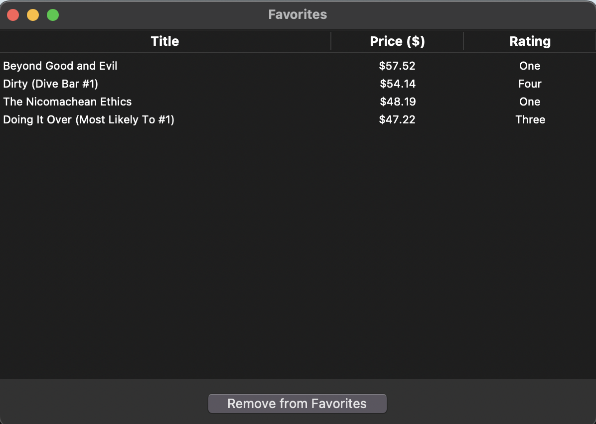
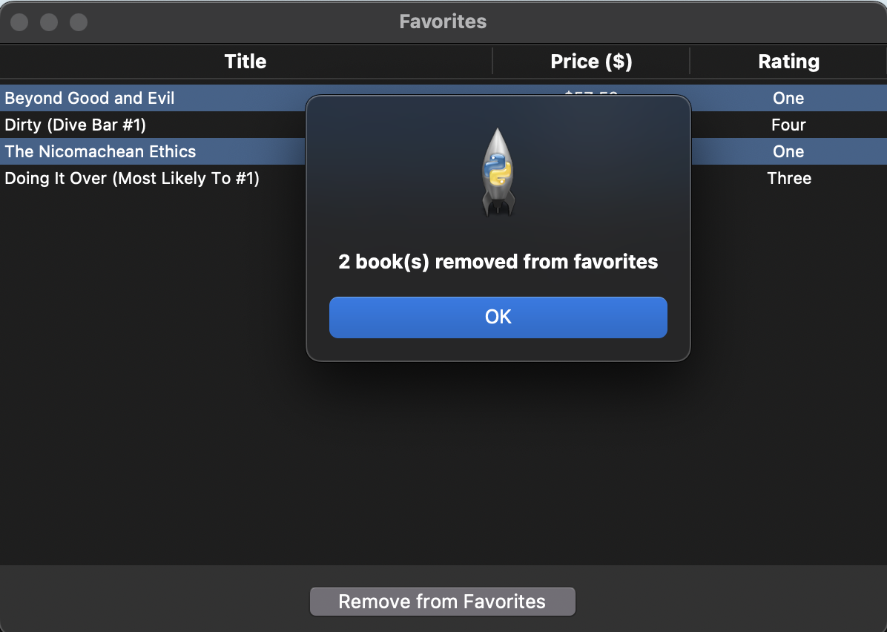

# web scraping python
GUI Web Scraping Project in Python

English:

Overview

This is a Graphical User Interface (GUI) project developed in Python using the Tkinter library. The purpose of this project is to perform web scraping on the website [Books to Scrape](http://books.toscrape.com), extracting data such as book titles, prices, and ratings, and presenting the scraped data in a user-friendly interface.

The project was developed during my time in college in the US, combining skills in Python, web scraping, and GUI development.

Features

	•	GUI Interface: Easy-to-use interface built with Tkinter, allowing users to interact with the scraping results visually.
	•	Web Scraping: Automatically scrapes book data (title, price, and rating) from the website Books to Scrape.
	•	Category Selection: Users can select one or more book categories to scrape.
	•	Sorting Options: Sort the scraped books by price (ascending or descending), title (A-Z or Z-A), and rating (low to high or high to low).
	•	Favorites: Allows users to select books and add them to a favorites list, with the ability to view and remove favorites.
	•	Export to Excel: The scraped data can be exported to an Excel file.
	•	Error Handling: Includes error messages for cases such as no categories selected or no books selected when adding to favorites.

How It Works

	1.	Category Selection: The GUI allows you to select one or more categories from the list (e.g., “Science Fiction”, “Romance”). Once selected, click the Scrape Selected Categories button to fetch book data from the chosen categories.
	2.	Sorting: After scraping, you can sort the book list using different criteria (price, title, or rating) using the dropdown menu.
	3.	Favorites: You can select books from the list and add them to your favorites. Favorites can be viewed, removed, or exported to Excel.
	4.	Export: The scraped data, including book title, price, and rating, can be exported to an Excel file for further use.

Obs: After running the code, you can press the button 'help' and see the instructions clearly and how it works.

Technologies Used

	•	Python: The core programming language used for the project.
	•	Tkinter: For building the GUI interface.
	•	Requests: To handle HTTP requests and fetch webpage data.
	•	BeautifulSoup: For parsing and scraping HTML content.
	•	Pandas: To handle data manipulation and export the data to an Excel file.

Contact

For any questions or feedback, feel free to contact me at [davilna889@gmail.com](mailto:davilna889@gmail.com).

Screenshots:

Tela princiapl:

Scrape Selected Categories:

Add to favorites:

View favorites window:

Removing from favorites:

Help page (instructions):

File and other options:

Português:

Visão Geral

Este é um projeto de Interface Gráfica (GUI) desenvolvido em Python usando a biblioteca Tkinter. O objetivo deste projeto é realizar web scraping no site [Books to Scrape](http://books.toscrape.com), extraindo dados como títulos de livros, preços e classificações, e apresentando os dados coletados em uma interface amigável ao usuário.

O projeto foi desenvolvido durante meu tempo na faculdade nos EUA, combinando habilidades em Python, web scraping e desenvolvimento de interfaces gráficas.

Funcionalidades

•	Interface GUI: Interface fácil de usar, construída com Tkinter, permitindo que os usuários interajam com os resultados do scraping visualmente.
•	Web Scraping: Faz automaticamente o scraping dos dados dos livros (título, preço e classificação) do site “Books to Scrape”.
•	Seleção de Categorias: Os usuários podem selecionar uma ou mais categorias de livros para fazer o scraping.
•	Opções de Ordenação: Ordene os livros coletados por preço (ascendente ou descendente), título (A-Z ou Z-A) e classificação (de menor para maior ou de maior para menor).
•	Favoritos: Permite que os usuários selecionem livros e os adicionem a uma lista de favoritos, com a capacidade de visualizar e remover favoritos.
•	Exportar para Excel: Os dados coletados podem ser exportados para um arquivo Excel.
•	Tratamento de Erros: Inclui mensagens de erro para casos como nenhuma categoria selecionada ou nenhum livro selecionado ao adicionar aos favoritos.

Como Funciona

	1.	Seleção de Categorias: A interface gráfica permite que você selecione uma ou mais categorias da lista (por exemplo, “Ficção Científica”, “Romance”). Após selecionar, clique no botão “Scrape Selected Categories” para buscar os dados dos livros das categorias escolhidas.
	2.	Ordenação: Após a coleta dos dados, você pode ordenar a lista de livros utilizando diferentes critérios (preço, título ou classificação) usando o menu suspenso.
	3.	Favoritos: Você pode selecionar livros da lista e adicioná-los aos seus favoritos. Os favoritos podem ser visualizados, removidos ou exportados para Excel.
	4.	Exportar: Os dados coletados, incluindo título do livro, preço e classificação, podem ser exportados para um arquivo Excel para uso posterior.

Obs: Após executar o código, você pode pressionar o botão ‘help’ e ver as instruções de forma clara sobre como funciona.

Tecnologias Utilizadas

•	Python: A linguagem de programação principal utilizada no projeto.
•	Tkinter: Para a construção da interface gráfica.
•	Requests: Para lidar com requisições HTTP e buscar dados da página web.
•	BeautifulSoup: Para analisar e extrair o conteúdo HTML.
•	Pandas: Para manipulação de dados e exportação para um arquivo Excel.

Contato

Para dúvidas ou feedback, fique à vontade para entrar em contato pelo email: [davilna889@gmail.com](mailto:davilna889@gmail.com).